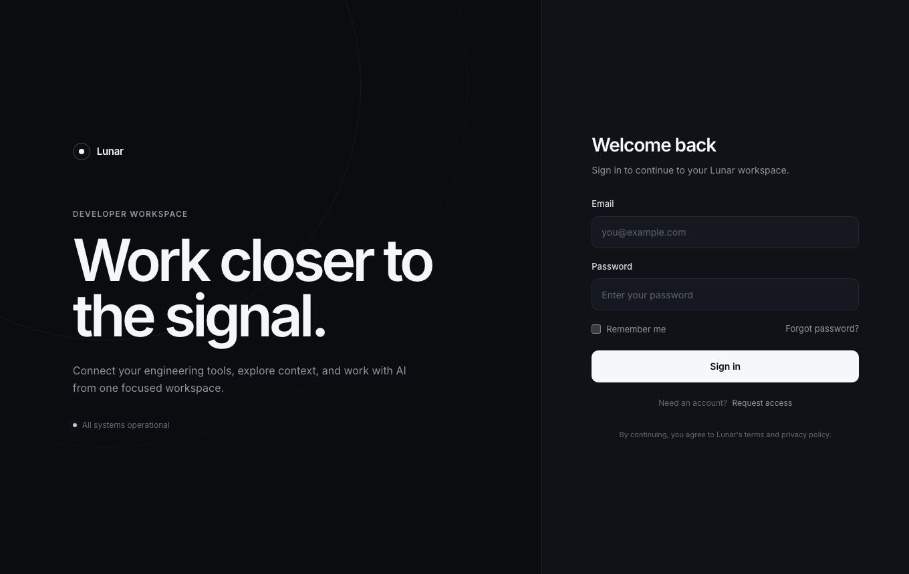
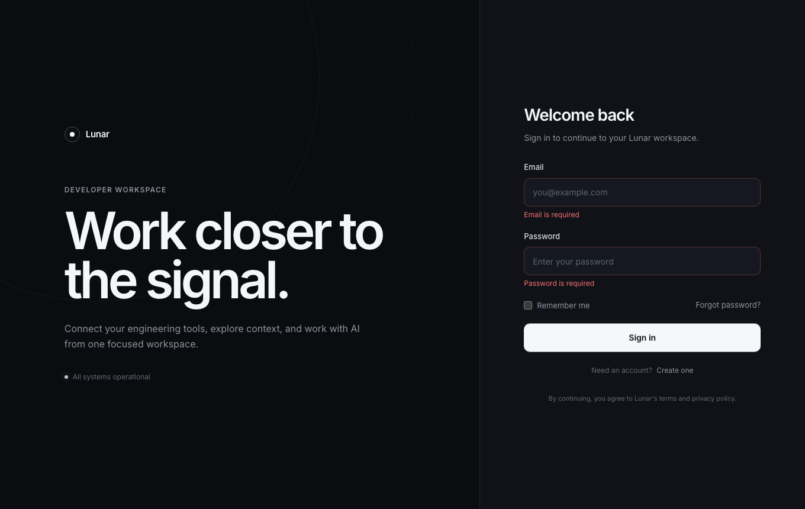
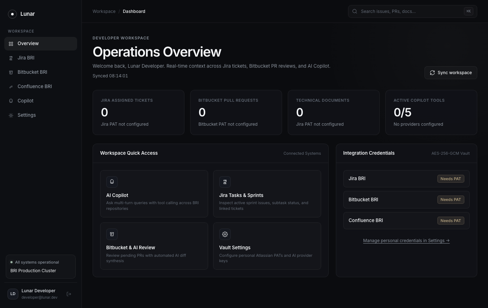

# Lunar QA Automation Report: Authentication Feature

## Executive Summary
This document provides automated testing results and visual evidence for the Lunar Authentication & Session Lifecycle feature. Tests were executed end-to-end using Playwright with headless Chrome against live Go backend and Vue 3 frontend services.

- **Status**: PASSED (100%)
- **Target URL**: `http://localhost:5173/login`
- **Execution Date**: 2026-09-29
- **Browser Engine**: Google Chrome (Playwright channel)
- **Tested User**: `developer@lunar.dev`

---

## Test Scenarios & Verification Steps

| Step | Action Description | Expected Outcome | Result |
| :--- | :--- | :--- | :--- |
| 1 | Navigate to `/login` | Render hero title "Work closer to the signal." and clean form | Pass |
| 2 | Submit empty form | Display client-side validation errors on required fields | Pass |
| 3 | Enter valid credentials with Remember Me | Input email, password, and toggle extended session | Pass |
| 4 | Submit authenticated form | Issue JWT, store token, and transition to `/dashboard` | Pass |

---

## Visual Evidence

### 1. Initial Login Screen

*Figure 1: Initial state of the Lunar authentication page displaying ambient dark theme and sign-in card.*

### 2. Client-Side Validation Error

*Figure 2: Form validation triggering field error alerts when attempting submission without required inputs.*

### 3. Populated Credentials with Remember Me

*Figure 3: Form populated with authenticated seed user credentials and active Remember Me selection.*

### 4. Successful Authentication & Dashboard Transition

*Figure 4: Seamless transition to the Operations Overview dashboard upon receiving authenticated JWT.*
