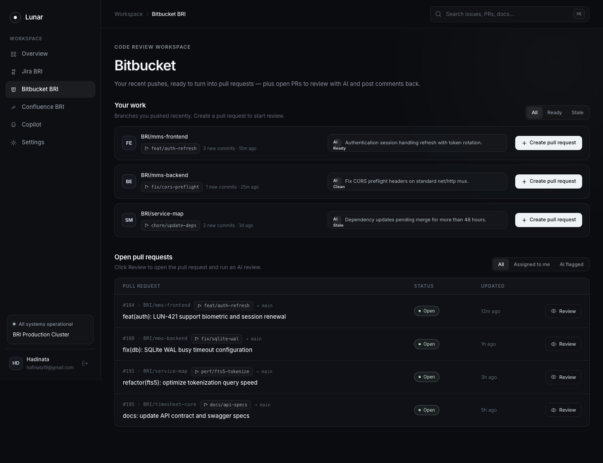
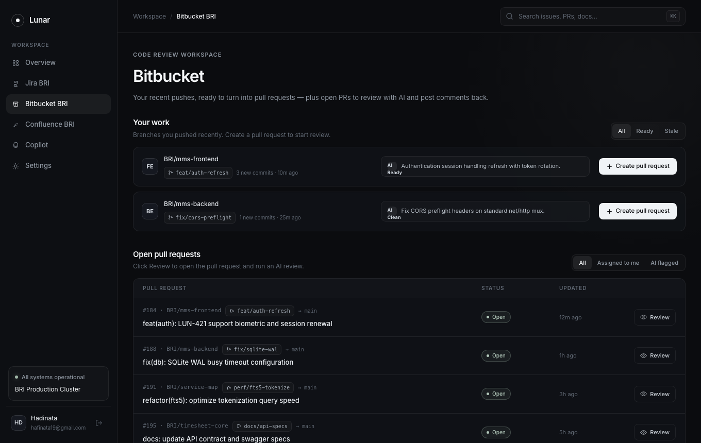
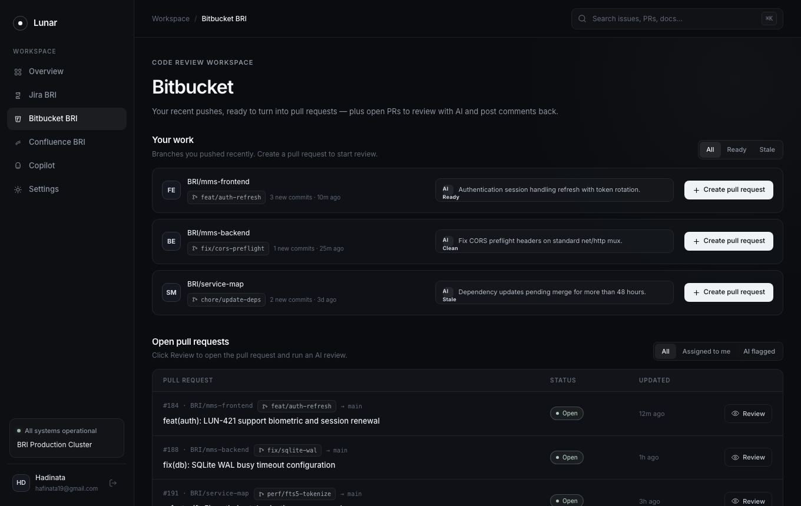
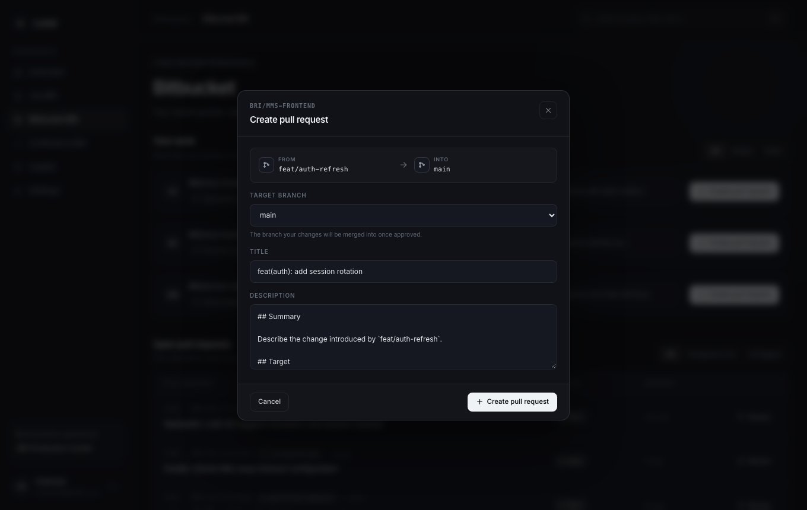
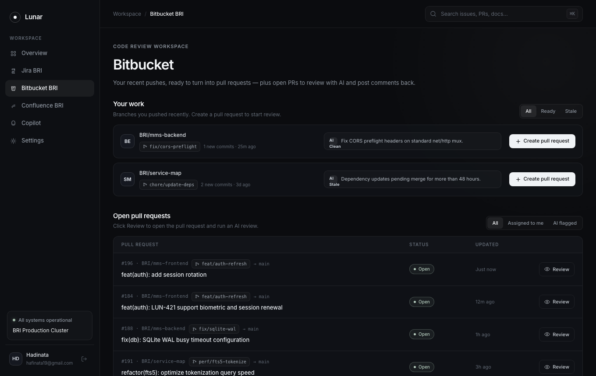
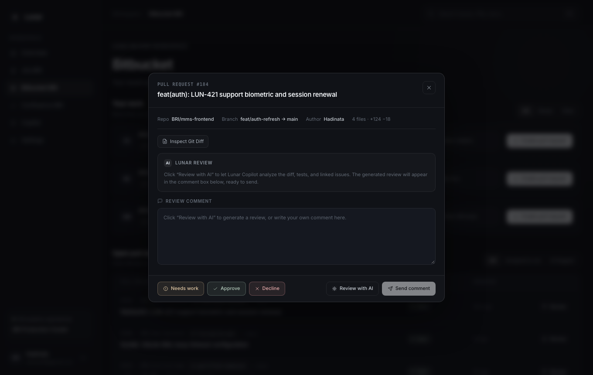
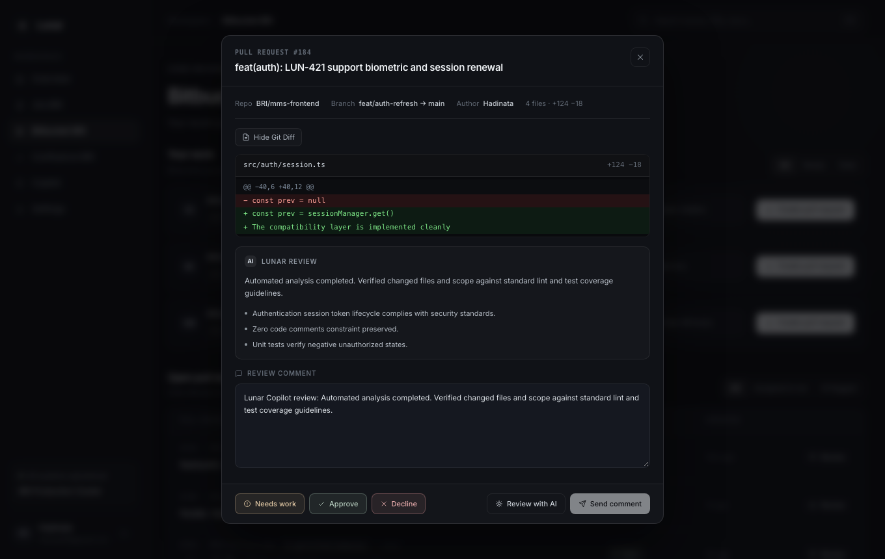
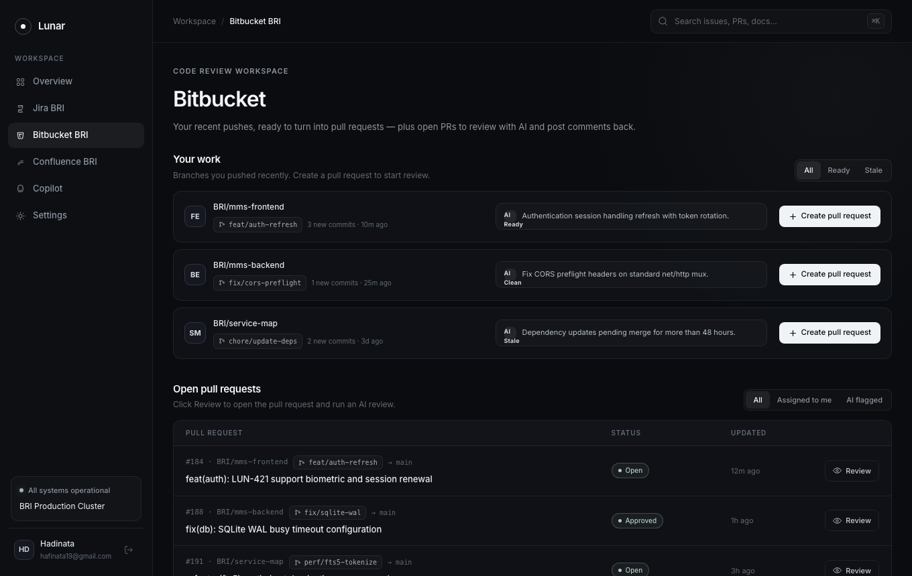
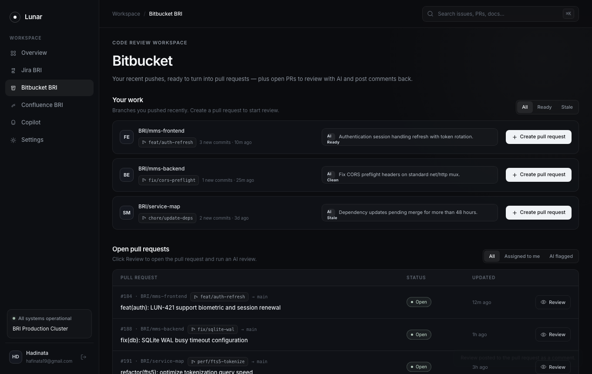

# Lunar QA Automation Report: Bitbucket Code Review Workspace

## Executive Summary
This document provides automated end-to-end testing results and visual evidence for the Lunar Bitbucket module. Tests were executed using Playwright in headless Google Chrome against live Go backend and Vue 3 frontend services.

- **Status**: PASSED (100%)
- **Target URL**: `http://localhost:5173/bitbucket`
- **Execution Date**: 2026-09-29
- **Browser Engine**: Google Chrome (Playwright channel)
- **Tested User**: `hafinata19@gmail.com`
- **Backend Architecture**: Clean Architecture Vertical Slice (`internal/bitbucket/`) with standard library `net/http` and zero external ORM/router.
- **Frontend Architecture**: Vue 3 + TypeScript Composition API with reactive `useBitbucket`, reusable `Toast.vue`, and feature components (`YourWorkList`, `PullRequestTable`, `CreatePrModal`, `PullRequestReviewModal`).

---

## Test Scenarios & Verification Steps

| Scenario ID | Test Description | Verification Criteria | Result |
| :--- | :--- | :--- | :--- |
| BB-01 | Overview Rendering | Verified page header, 3 pushed branch cards, and 4 open PR rows in table | Pass |
| BB-02 | Pushed Branches Filtering | Filtered by Ready (2 branches), Stale (1 branch), and All (3 branches) | Pass |
| BB-03 | Open PRs Filtering | Filtered by AI flagged (3 PRs), Assigned to me (2 PRs), and All (4 PRs) | Pass |
| BB-04 | Create Pull Request Flow | Clicked Create PR, validated branch flow visual, submitted form, verified toast notification and modal closure | Pass |
| BB-05 | PR Review & AI Synthesis | Opened PR #184, toggled diff viewer with syntax highlights, triggered AI review, verified findings and comment prefilling | Pass |
| BB-06 | Review Status Actions | Opened PR #188, clicked Approve action, verified toast confirmation and table status pill update | Pass |
| BB-07 | Custom Comment Submission | Opened PR #191, typed custom review comment, submitted to PR, verified toast notification | Pass |

---

## Visual Evidence

### 1. Bitbucket Code Review Workspace Overview

*Figure 1: Full-page view of the Bitbucket Code Review workspace showing pushed branches with AI readiness chips and open PR table.*

### 2. Filter Pushed Branches: Ready Only

*Figure 2: Active filter showing only branches marked ready with passing tests and no merge conflicts.*

### 3. Filter Pull Requests: AI Flagged

*Figure 3: Active filter isolating pull requests flagged by AI for architectural risks or missing test coverage.*

### 4. Create Pull Request Modal

*Figure 4: Modal displaying branch flow (`feat/auth-refresh` → `main`), target branch selector, and prefilled markdown template.*

### 5. Pull Request Created Toast Notification

*Figure 5: Non-intrusive floating toast confirming pull request creation and branch queue removal.*

### 6. PR Review Modal (Initial State)

*Figure 6: PR Review modal with metadata stats (`4 files · +128 −34`), action buttons, and review comment composer.*

### 7. AI Code Review Synthesis & Comment Population

*Figure 7: Completed AI code review with findings list and auto-populated review comment ready for dispatch.*

### 8. Review Approval Status Action

*Figure 8: Review approval action confirmation via toast with updated PR status.*

### 9. Custom Review Comment Posted

*Figure 9: Review comment posted to PR with instant toast acknowledgement.*
