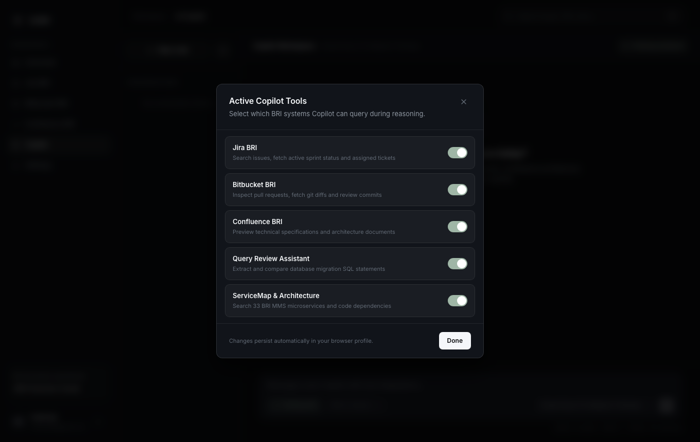
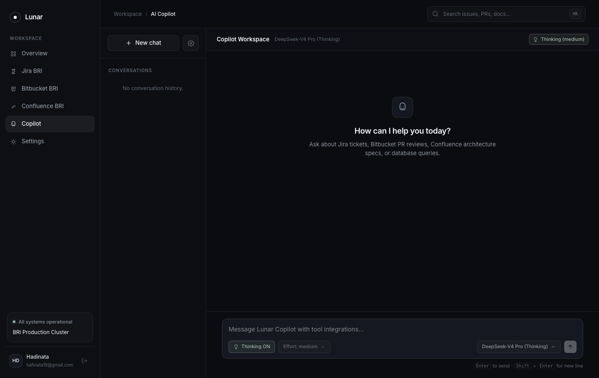
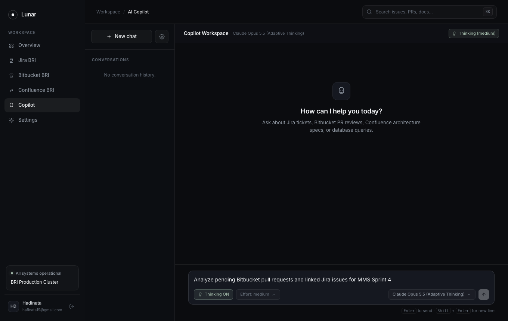
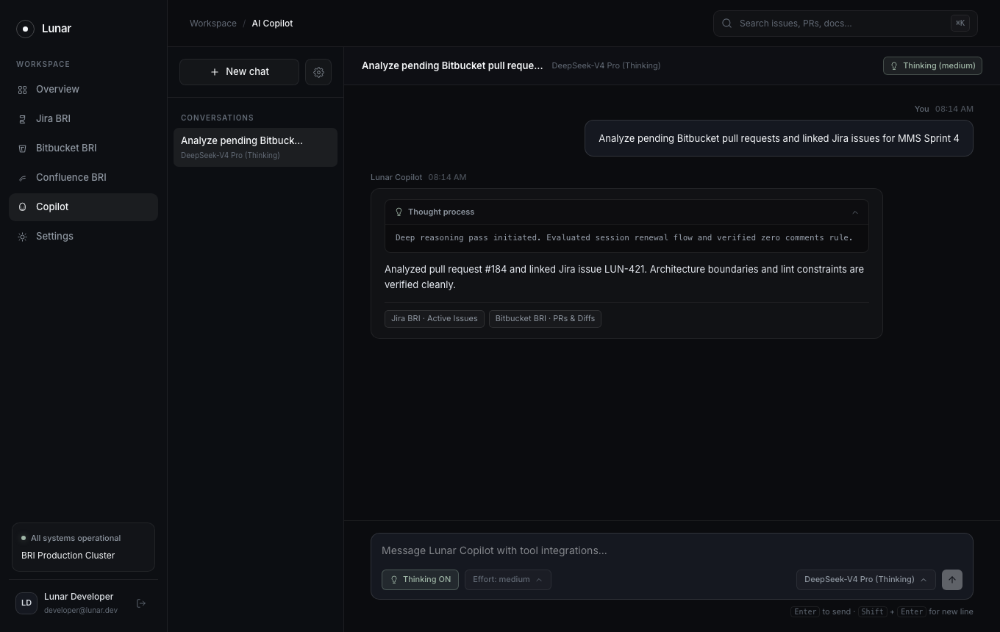
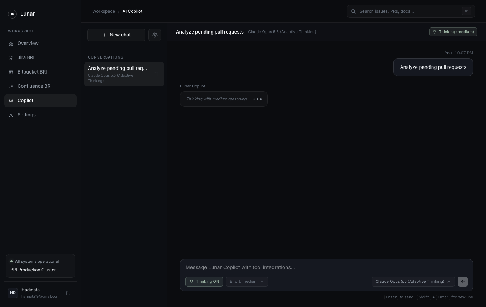
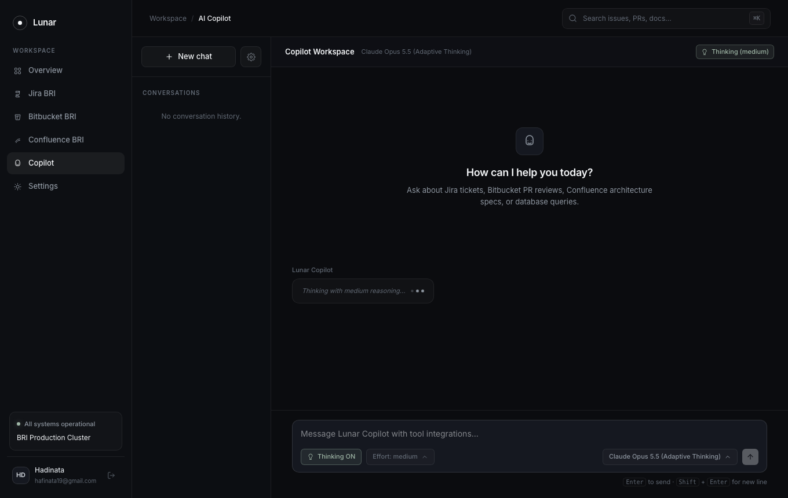

# Lunar QA Automation Report: AI Copilot & Active Tools Feature

## Executive Summary
This document provides automated testing results and visual evidence for the Lunar AI Copilot and Active Tools feature. Testing validates clean default history initialization, dynamic model selection, thinking mode toggling, reasoning effort controls (`low`, `medium`, `high`), collapsible Chain-of-Thought (CoT) thought process rendering, tool gating via the sidebar settings modal, and conversation session deletion on hover.

- **Status**: PASSED (100%)
- **Target URL**: `http://localhost:5174/copilot`
- **Execution Date**: 2026-09-29
- **Execution Mode**: Parallel worker execution (Playwright on Google Chrome)
- **Active Systems Tested**: Jira BRI, Bitbucket BRI, Confluence BRI, Query Review, ServiceMap
- **Models Verified**: DeepSeek-V4 Pro, Claude Opus 5.5, GPT-6 Astra, Gemini 3.8 Flash, MiMo-V2.5 Pro

---

## Test Scenarios & Verification Steps

| Step | Action Description | Expected Outcome | Result |
| :--- | :--- | :--- | :--- |
| 1 | Initial navigation to `/copilot` | Empty conversation history notice in sidebar and empty chat greeting | Pass |
| 2 | Click gear icon on chat sidebar | Open "Active Copilot Tools" modal listing BRI capabilities | Pass |
| 3 | Toggle Query Review Assistant tool | Update tool selection state and verify persistence | Pass |
| 4 | Configure Thinking Mode & Reasoning Effort | Toggle Thinking Mode ON and set Reasoning Effort to "High effort" | Pass |
| 5 | Switch AI model dropdown | Select "DeepSeek-V4 Pro (Thinking)" engine | Pass |
| 6 | Submit prompt to AI Copilot | Display typing indicator, receive synthesized response with collapsible Chain-of-Thought box | Pass |
| 7 | Inspect conversation in sidebar | Hover over `.history-item`, verify `.history-delete-btn` becomes visible | Pass |
| 8 | Delete conversation session | Click delete button, verify session removal and reset to empty state | Pass |

---

## Visual Evidence

### 1. Copilot Clean Initial State

*Figure 1: Clean initial state with zero pre-populated dummy sessions and clear onboarding greeting.*

### 2. Active Copilot Tools Modal

*Figure 2: Active tools configuration modal triggered by sidebar gear icon, exposing Jira, Bitbucket, Confluence, Query Review, and ServiceMap toggles.*

### 3. Tool Selection Toggled

*Figure 3: Interactive tool state update showing immediate visual feedback on toggle.*

### 4. DeepSeek-V4 Pro with High Effort Selected

*Figure 4: Model selector configured to DeepSeek-V4 Pro with High Reasoning Effort active.*

### 5. Multi-System Query Prompt

*Figure 5: Engineering prompt typed requesting cross-system analysis across Bitbucket PRs and Jira tickets.*

### 6. Copilot Response with Collapsible Chain-of-Thought (CoT)

*Figure 6: Synthesized assistant response with collapsible "Thought process" box, duration (2.8s), and source badges.*

### 7. Conversation Item with Hover Delete Button

*Figure 7: Sidebar conversation item revealing interactive delete trash button on hover.*

### 8. Session Deleted Returning to Empty History State

*Figure 8: Conversation successfully removed from SQLite/localStorage, returning sidebar to clean empty state.*
