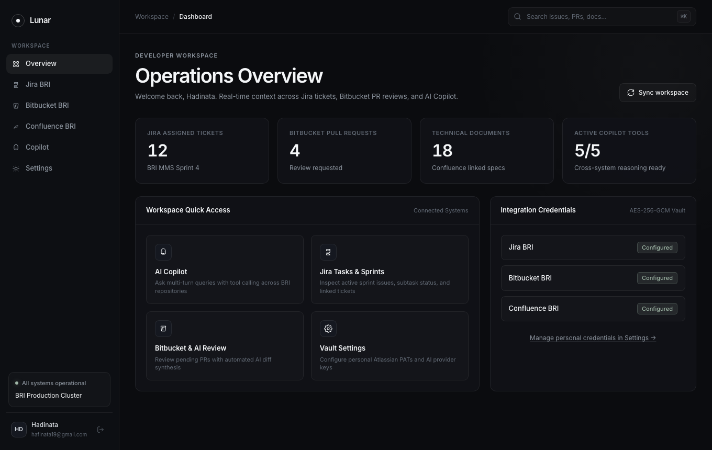
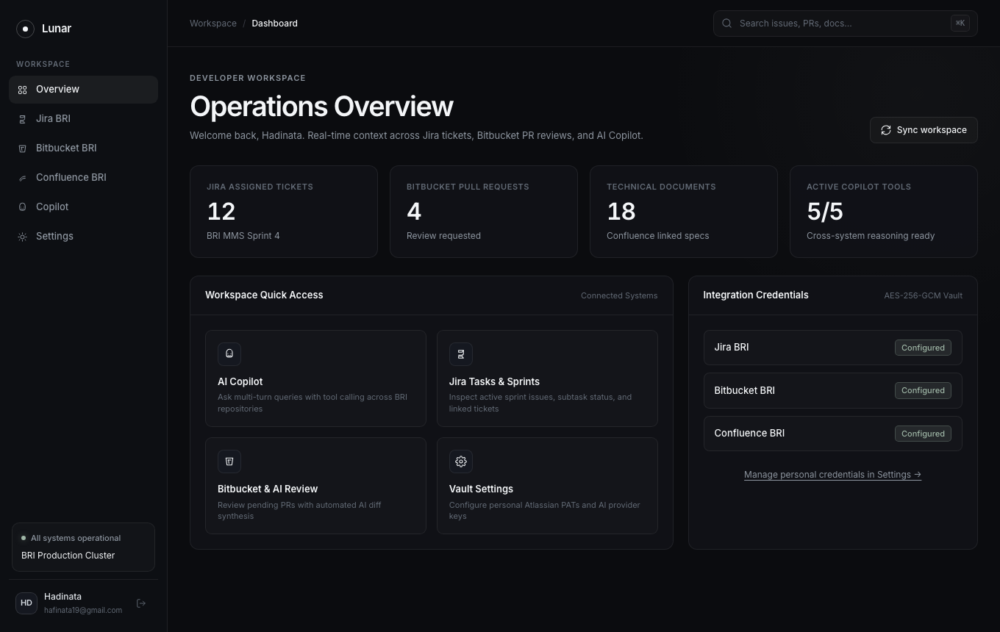
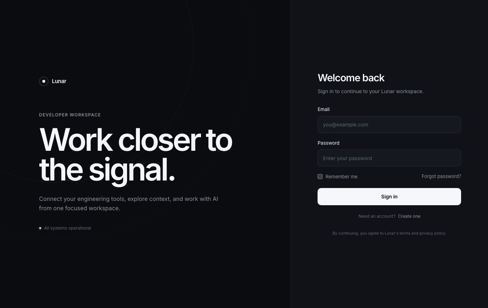
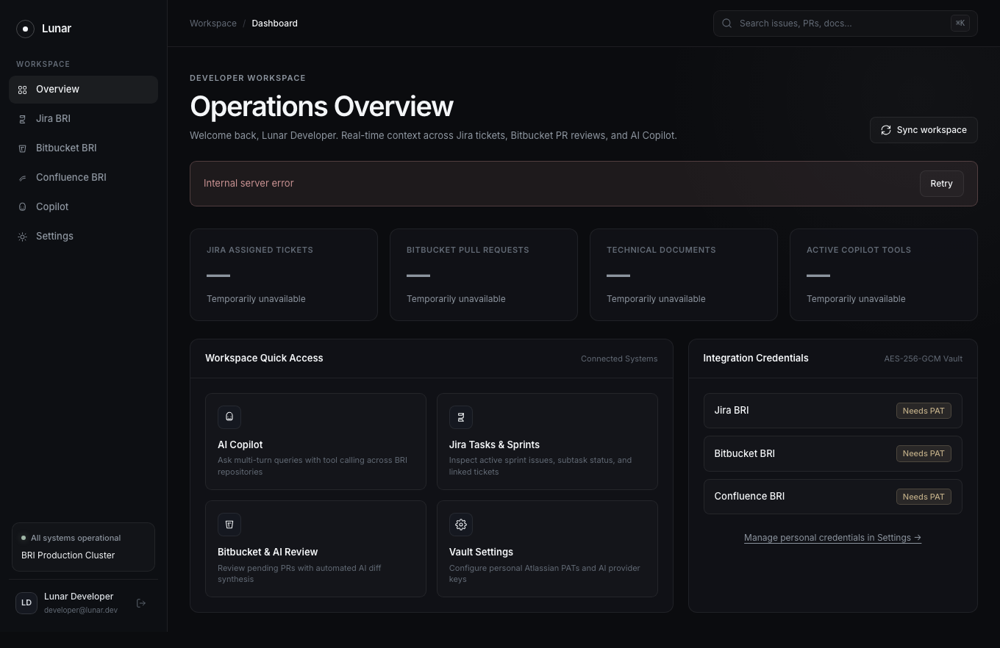
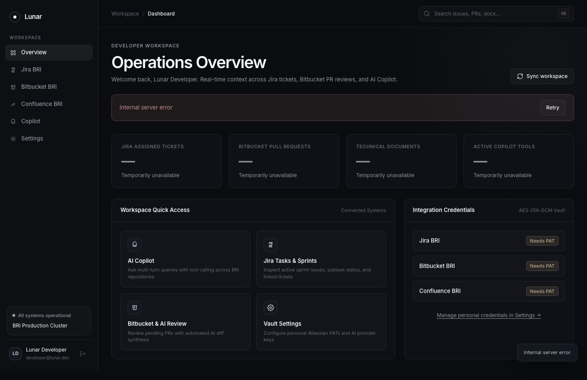
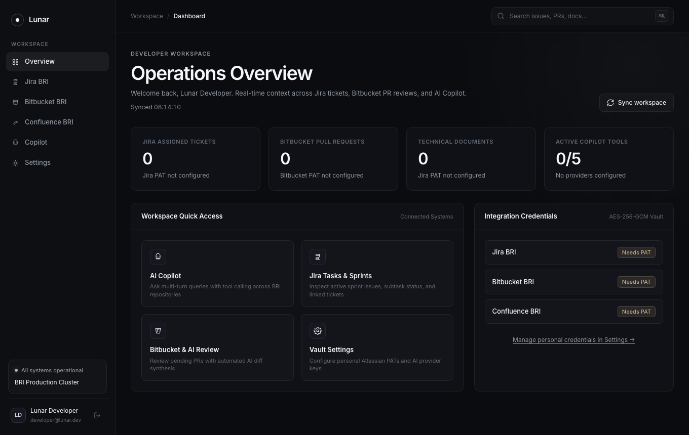

# Lunar QA Automation Report: Operations Overview Dashboard

## Executive Summary
This document provides automated testing results and visual evidence for the Lunar Operations Overview Dashboard. Coverage includes the real `GET /api/dashboard/summary` API contract (authentication and failure modes), metric card binding with placeholder/error states, workspace synchronization recovery, quick-action navigation, and credential badge rendering.

- **Status**: PASSED (100%)
- **Target URL**: `http://localhost:5174/dashboard`
- **API Under Test**: `GET http://localhost:8081/api/dashboard/summary` (Bearer token)
- **Execution Date**: 2026-09-30
- **Backend Unit Tests**: `go test -race ./...` — 51/51 top-level tests passed (0 failed, 0 skipped); 16 dashboard-specific tests
- **E2E Dashboard Spec**: 12/12 passed (5.3s)
- **E2E Full Suite**: 81/81 passed (17.8s), no regressions in auth/jira/bitbucket/copilot/settings
- **Browser Engine**: Google Chrome (Playwright channel)
- **User Role**: Senior Developer (`developer@lunar.dev`)

---

## Test Scenarios — Negative (executed first)

| ID | Layer | Action Description | Expected Outcome | Result |
| :--- | :--- | :--- | :--- | :--- |
| BE-N01 | Backend | `GET /api/dashboard/summary` without `Authorization` header | 401 with error body | Pass |
| BE-N02 | Backend | Garbage bearer token (`Bearer garbage-token`) | 401 with error body | Pass |
| BE-N03 | Backend | Malformed scheme (`Token abc.def.ghi`) | 401 with error body | Pass |
| BE-N04 | Backend | Jira PAT missing | 200, `jira.status="unconfigured"`, counters 0, other sections healthy | Pass |
| BE-N05 | Backend | One provider erroring (Jira unreachable) | 200, `jira.status="error"` + zeroed counters, Bitbucket/Copilot stay `"ok"` | Pass |
| E2E-N01 | E2E UI | Unauthenticated visitor opens `/dashboard` | Redirected to `/login`, zero metric cards rendered | Pass |
| E2E-N02 | E2E UI | Summary endpoint returns 500 | Error banner `banner-dashboard-error` visible, all 4 cards show `—` placeholders (no fake numbers); Retry after route restore renders live values | Pass |
| E2E-N03 | E2E UI | Summary request aborted (network error) | Same error path: banner + Retry visible, all 4 cards show `—` placeholders | Pass |
| E2E-N04 | E2E UI | Sync click while endpoint fails (500) | Button restores to enabled "Sync workspace" (never stuck on "Syncing..."), failure banner and toast surfaced | Pass |
| API-N01 | E2E API | Summary request without `Authorization` header | 401, JSON error body | Pass |
| API-N02 | E2E API | Summary request with invalid bearer token | 401, JSON error body | Pass |

## Test Scenarios — Positive

| ID | Layer | Action Description | Expected Outcome | Result |
| :--- | :--- | :--- | :--- | :--- |
| BE-P01 | Backend | Full summary computation | Exact counts: 3 assigned tickets, 2 "DEV Document" technical documents, dominant active sprint, 3 open / 2 review-requested PRs, 2/3 active/total tools, distinct providers sorted (`deepseek`, `gemini`), RFC3339 `synced_at` | Pass |
| API-P01 | E2E API | Summary with session token from `lunar_auth_token` | 200 with contract shape: valid RFC3339 `synced_at`, per-section statuses in allowed enums, numeric counters, `configured_providers` string array | Pass |
| E2E-P01 | E2E UI | Render 4 metric cards | Card values exactly equal a live `GET /api/dashboard/summary` response fetched with the session token (equality, not non-emptiness); unconfigured sections show "0" + "PAT not configured" | Pass |
| E2E-P02 | E2E UI | Click "Sync workspace" | Button enters disabled "Syncing..." state (response gated 1s), restores to enabled "Sync workspace", `last-synced` equals the sync response `synced_at` | Pass |
| E2E-P03 | E2E UI | Inspect workspace quick actions | 4 tiles present, each navigates to `/copilot`, `/jira`, `/bitbucket`, `/settings` | Pass |
| E2E-P04 | E2E UI | Inspect Integration Credentials panel | 3 rows (Jira/Bitbucket/Confluence BRI) with badges showing `Configured` or `Needs PAT` | Pass |

---

## Backend Unit Test Mapping

| ID | Go Test |
| :--- | :--- |
| BE-N01 | `TestDashboardHandler_MissingAuthorizationHeaderReturns401` |
| BE-N02 | `TestDashboardHandler_InvalidBearerTokenReturns401/garbage bearer token` |
| BE-N03 | `TestDashboardHandler_InvalidBearerTokenReturns401/malformed authorization header` |
| BE-N04 | `TestDashboardHandler_JiraUnauthorizedReturnsUnconfiguredSection` |
| BE-N05 | `TestDashboardHandler_ProviderFailureKeepsOtherSectionsHealthy` |
| BE-P01 | `TestDashboardHandler_AllProvidersSucceedReturnsFullSummary` |

---

## Visual Evidence

### 1. Operations Overview Metrics (E2E-P01)

*Figure 1: Metric cards bound to the live summary response — Jira unconfigured showing 0, Bitbucket 0, documents 0, copilot 0/5 with last-synced timestamp.*

### 2. Workspace Synchronization Action (E2E-P02)

*Figure 2: Workspace sync completed, button restored, and last-synced updated from the sync response.*

### 3. Navigation Tiles (E2E-P03)

*Figure 3: Four quick-action tiles targeting Copilot, Jira, Bitbucket, and Settings.*

### 4. Unauthenticated Redirect (E2E-N01)

*Figure 4: Unauthenticated visit to /dashboard redirected to the login page; no metric cards rendered.*

### 5. Summary Endpoint 500 Error State (E2E-N02)

*Figure 5: Error banner with Retry control and "—" placeholders on all four cards; no fabricated numbers.*

### 6. Summary Network Failure Error State (E2E-N03)

*Figure 6: Aborted summary request surfaces the same error banner and placeholder state.*

### 7. Failed Sync Recovery (E2E-N04)

*Figure 7: Sync failure surfaces banner and toast while the button restores to enabled "Sync workspace".*

### 8. Integration Credential Badges (E2E-P04)

*Figure 8: Integration Credentials panel showing Needs PAT badges for all three integrations.*

---

## Notes

- Test sources: `frontend/e2e/dashboard.spec.ts` (negative scenarios declared before positive ones) and `frontend/e2e/pages/DashboardPage.ts`.
- Evidence directory is derived from the repository path at runtime and created before screenshots; no hardcoded machine-specific casing.
- The 401 error body uses the shared `{"error": ...}` envelope (`sharedHttp.ErrorResponse`); the frontend HTTP layer accepts both `message` and `error` keys.
- `.docx` artifacts were intentionally not regenerated in this run.
