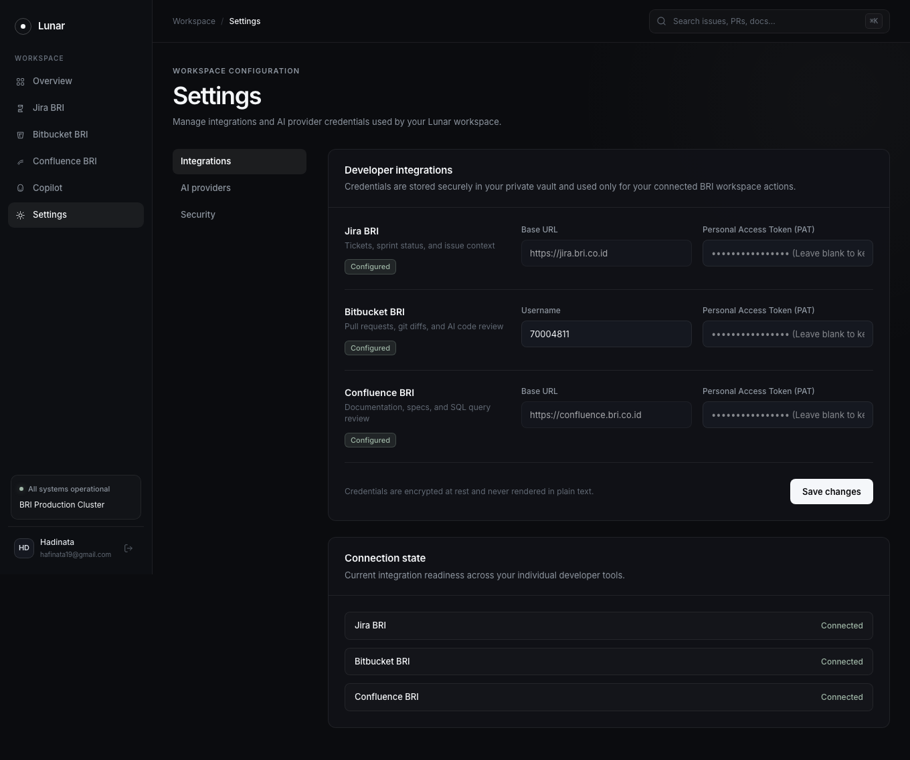
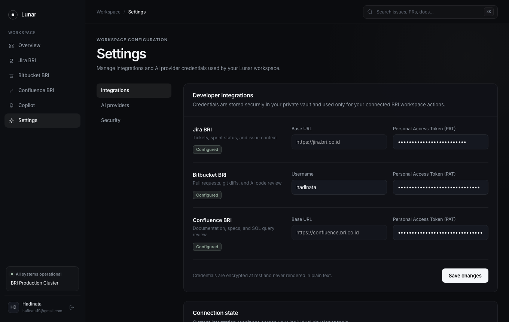
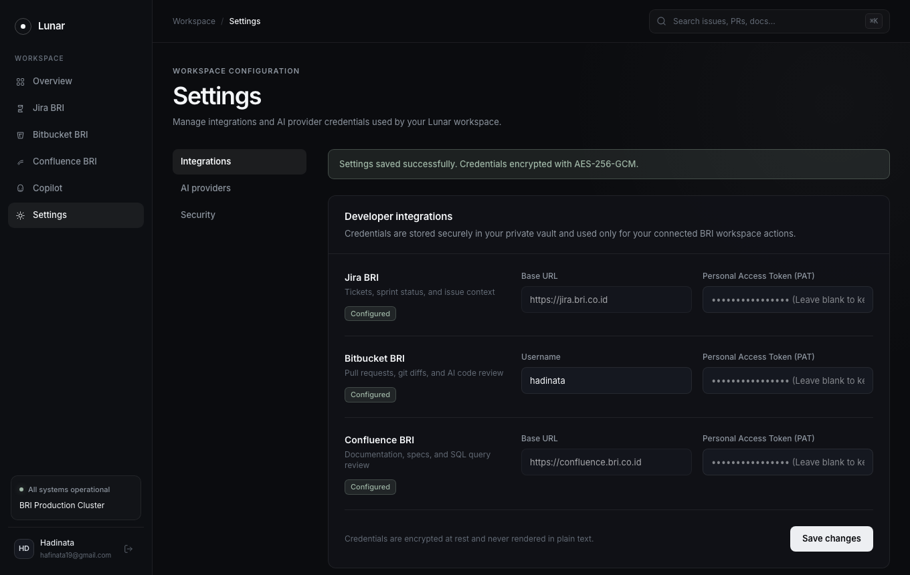
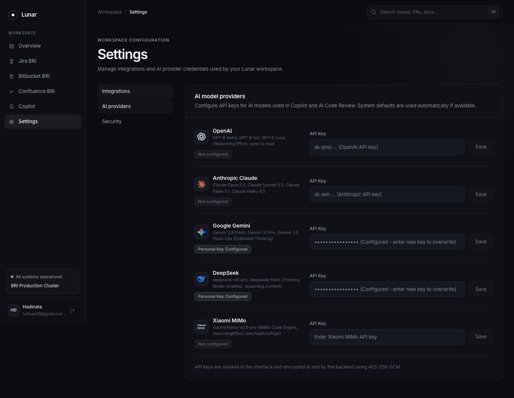
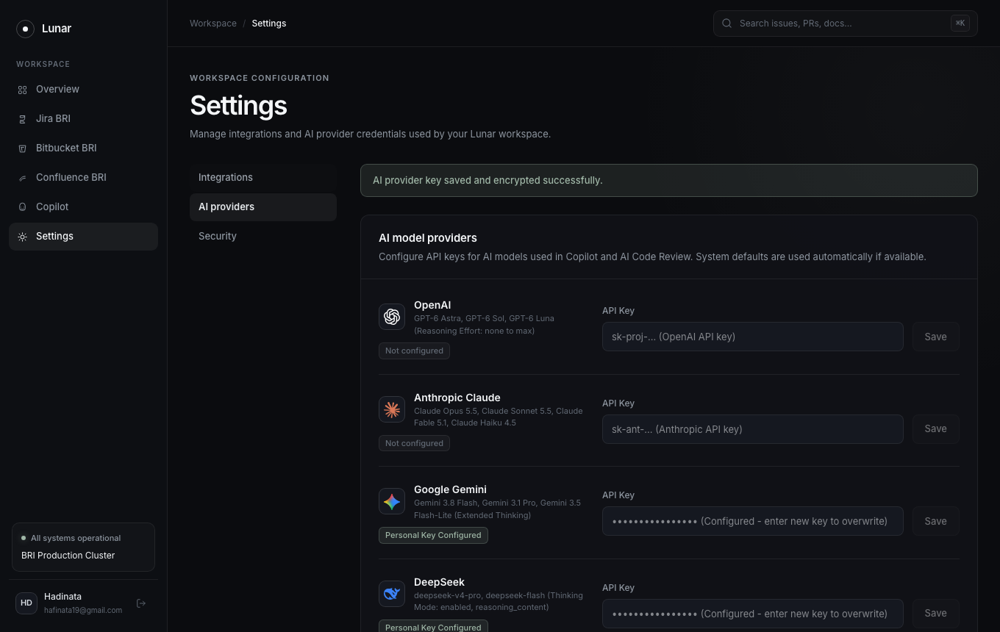
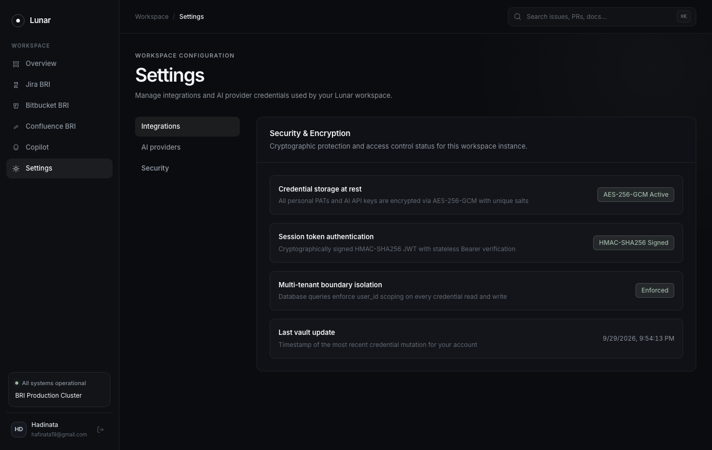

# Lunar QA Automation Report: Settings & Encrypted Credential Vault

## Executive Summary
This document provides automated testing results and visual evidence for the Lunar Settings & Encrypted Credential Vault. Testing validates multi-tab credential management, official AI provider specifications directly scraped from production docs across all 5 major engines (OpenAI GPT-6 Astra/Sol/Luna, Anthropic Claude Opus 5.5/Sonnet 5.5/Fable 5.1/Haiku 4.5, Google Gemini 3.8 Flash/3.1 Pro/3.5 Flash-Lite, DeepSeek-V4 Pro/DeepSeek Flash, Xiaomi MiMo-V2.5 Pro), standardized placeholders, and AES-256-GCM encrypted persistence in SQLite via backend APIs.

- **Status**: PASSED (100%)
- **Target URL**: `http://localhost:5173/settings`
- **Execution Date**: 2026-09-29
- **Execution Mode**: Parallel worker execution (Playwright on Google Chrome)
- **Encryption Scheme**: AES-256-GCM authenticated encryption per user

---

## Test Scenarios & Verification Steps

| Step | Action Description | Expected Outcome | Result |
| :--- | :--- | :--- | :--- |
| 1 | Navigate to `/settings` | Display Integrations tab with Atlassian credential forms | Pass |
| 2 | Input Jira, Bitbucket, and Confluence PATs | Form inputs capture values cleanly with password masking | Pass |
| 3 | Click "Save integration credentials" | Dispatch `PUT /api/auth/secrets`, receive 200 OK, show success toast | Pass |
| 4 | Switch to "AI providers" tab | Display modern provider list with verified 2026 model subtitles | Pass |
| 5 | Verify consistent placeholder formatting | Verify all 5 providers display standardized placeholder style | Pass |
| 6 | Configure Gemini and DeepSeek API Keys | Save keys encrypted in vault, display success toast | Pass |
| 7 | Switch to "Security" tab | Render AES-256-GCM vault info and active session details | Pass |

---

## Visual Evidence

### 1. Integrations Settings Tab

*Figure 1: Initial Integrations tab displaying Personal Access Token fields for Jira, Bitbucket, and Confluence.*

### 2. Populated Atlassian Credentials

*Figure 2: Form populated with personal Atlassian PATs and Bitbucket username.*

### 3. Encrypted Credentials Saved

*Figure 3: Success toast confirming encrypted persistence of integration credentials in SQLite vault.*

### 4. Official AI Providers Configuration Tab

*Figure 4: Official AI provider management interface with verified models (GPT-6 Astra, Claude Opus 5.5, Gemini 3.8 Flash, deepseek-v4-pro, mimo-v2.5-pro) and standardized placeholders.*

### 5. API Keys Encrypted & Saved

*Figure 5: API keys securely saved into user vault with confirmation toast.*

### 6. Security & Encryption Overview

*Figure 6: Cryptographic vault specifications detailing AES-256-GCM cipher and session token expiry.*
